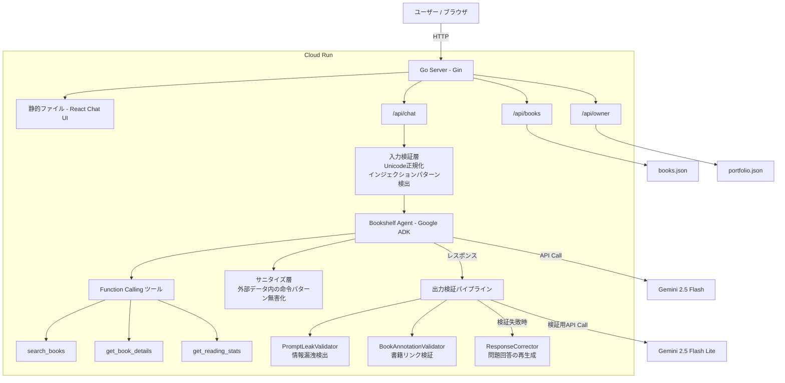

# TB: Talking Bookshelf

AI を活用した対話型本棚キャラクター。オーナーの読書体験を会話を通じて紹介します。

本番サイト: https://talkingbookshelf.com/

> このリポジトリは [Zenn 第4回 Agentic AI Hackathon with Google Cloud](https://zenn.dev/hackathons/google-cloud-japan-ai-hackathon-vol4) の審査用公開リポジトリです。
> 本番 UI（本棚キャラクター・顔アニメーション等）は含まず、簡易チャット UI が付属しています

## アーキテクチャ



## 技術スタック

| カテゴリ        | 技術                           |
| --------------- | ------------------------------ |
| バックエンド    | Go 1.23 + Gin                  |
| Agent Framework | Google ADK v0.3.0              |
| LLM             | Gemini 2.5 Flash + Flash Lite  |
| フロントエンド  | React 19 + TypeScript + Vite 7 |
| ホスティング    | Google Cloud Run               |

## Agent 実装

### Function Calling ツール

エージェントは 3 つのカスタムツールで本棚データに自律的にアクセスします。

| ツール              | 説明                                           |
| ------------------- | ---------------------------------------------- |
| `search_books`      | キーワードで書籍を検索（タイトル・著者・メモ） |
| `get_book_details`  | 書籍詳細取得（private_notes 含む）             |
| `get_reading_stats` | 読書統計（冊数・ジャンル等）                   |

### セッション管理

- マルチターン会話に対応
- 直近 3 ターン（6 イベント）を保持し、超過時は会話履歴をテキストとして引き継ぐ
- 推薦履歴を保持し、同じ本を繰り返し推薦しない

### Validation Pipeline

ハルシネーション防止と品質担保のための多段検証パイプラインです。

**Validators（検証）**

1. PromptLeakValidator: システムプロンプトや内部情報の漏洩を検出
2. BookAnnotationValidator: `[book::タイトル::id]` リンクの存在・タイトル一致を検証

**ResponseCorrector（修正）**

検証に失敗した場合、ResponseCorrectorが自動的に回答を再生成します（Gemini 2.5 Flash Lite使用）

### セキュリティ（多層防御）

3 層の防御でプロンプトインジェクションに対策しています。

1. 入力検証層: Unicode 正規化、文字数制限、インジェクションパターン検出
2. サニタイズ層: 外部データ内の命令パターンを無害化（間接インジェクション対策）
3. 出力検証層: レスポンス内のプロンプト漏洩・情報露出を検出

## クイックスタート

### 前提条件

- Node.js 20+
- Go 1.23+
- Gemini API キー（[AI Studio](https://aistudio.google.com/) から取得）

### セットアップ

以下のコマンドで環境を構築できます。

```bash
git clone https://github.com/shusukeO/talking-bookshelf-contest-public.git
cd talking-bookshelf-contest-public

# 依存関係のインストール
npm install
cd frontend && npm install
cd ../backend && go mod download
cd ..

# 環境変数の設定
echo "GEMINI_API_KEY=your_key" > backend/.env.local
echo "PORT=8080" >> backend/.env.local

# 開発サーバーの起動
npm run dev
```

起動後のアクセス先は以下の通りです。

- フロントエンド: http://localhost:5173
- バックエンド API: http://localhost:8080/api

### curl で試す

```bash
# 書籍一覧
curl http://localhost:8080/api/books

# チャット
curl -X POST http://localhost:8080/api/chat \
  -H "Content-Type: application/json" \
  -d '{"message": "おすすめの本は？"}'

# オーナー情報
curl http://localhost:8080/api/owner
```

## API エンドポイント

| メソッド | パス           | 説明         |
| -------- | -------------- | ------------ |
| GET      | /api/books     | 全書籍一覧   |
| GET      | /api/books/:id | 書籍詳細     |
| POST     | /api/chat      | AI チャット  |
| GET      | /api/owner     | オーナー情報 |

### POST /api/chat

```json
// リクエスト
{
  "message": "おすすめの本は？",
  "bookId": "book-001",       // 任意: 特定の本について会話
  "sessionId": "uuid",        // 任意: 会話の継続
  "language": "ja"            // 任意: "ja" or "en"
}

// レスポンス
{
  "response": "おすすめは [book::リーダブルコード::book-004] だよ！...",
  "emotion": "talking",
  "suggestions": ["どこが印象に残った？", "他のジャンルは？"],
  "sessionId": "uuid"
}
```

## ディレクトリ構成

```
├── backend/
│   ├── cmd/server/main.go         # エントリーポイント
│   ├── internal/
│   │   ├── agent/                 # Bookshelf Agent (ADK)
│   │   │   ├── bookshelf.go       # エージェント制御
│   │   │   ├── tools.go           # Function Calling ツール
│   │   │   ├── prompt/            # システムプロンプト構築
│   │   │   ├── validation/        # 出力検証パイプライン
│   │   │   ├── sanitize/          # 間接インジェクション対策
│   │   │   └── response/          # レスポンスパーサー（感情・サジェスチョン）
│   │   ├── handler/               # API ハンドラ
│   │   ├── middleware/            # レート制限、セキュリティヘッダー
│   │   ├── model/                 # データモデル
│   │   └── portfolio/             # ポートフォリオデータ読込
│   └── data/                      # サンプル書籍・ポートフォリオデータ
│
├── frontend/                      # 簡易チャット UI
│   └── src/
│       ├── App.tsx                # チャット画面
│       └── main.tsx               # エントリーポイント
│
├── Dockerfile                     # マルチステージビルド（Cloud Run 用）
└── README.md
```

## 注意事項

このリポジトリは審査用に一部を省略・差し替えています。

- 本番 UI（本棚キャラクター・顔アニメーション・背表紙表示等）は非公開。簡易チャット UI が付属
- 書籍メモとポートフォリオはサンプルデータに差し替え済み
- システムプロンプト・検証プロンプト・再生成プロンプトは構造をコメントで残し、実際の内容は省略
- インジェクション検出・サニタイズ・プロンプト漏洩検出の正規表現パターンも同様に省略
- レート制限・セキュリティヘッダーの実装と設定値も同様に省略

いずれもコード内のコメントで構造と意図を確認できます。

## ライセンス

All Rights Reserved。閲覧・参照のみ許可。詳細は [LICENSE](LICENSE) を参照してください。
